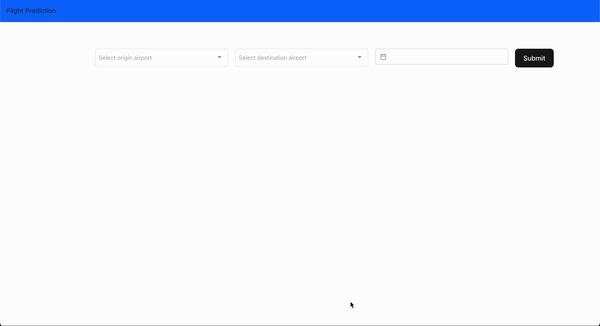

# Flight Prediction App

This project is accordance to Machine Learning Course for 2023 August Semester in Asian Institute of Tenchnology, Thailand. The contributors to this project are as follows (alphabetically):

- Biraj Koirala
- Jannutun Nayeem
- Jiewen Shen
- Stabya Acharya
- Sunil Prajapati


## Description

This project serves as the frontend part for the flight prediction api. It serves a simple page to input origin and destination airport along with the date.

The api is currently deployed with Heroku at: https://flight-prediction-api-e1805e5c4a40.herokuapp.com/

Demo:



### To run the app locally
Pre-requisites:

- Node
- Vite
- Yarn

First install all the packages using the command

`yarn install`

Copy the .env.example to .env and update the environment variables as necessary

```
VITE_API_BASE_URL=http://localhost:4000
```

Run the developmental server using command

`yarn dev`

The app should be avaiable at http://localhost:5173

